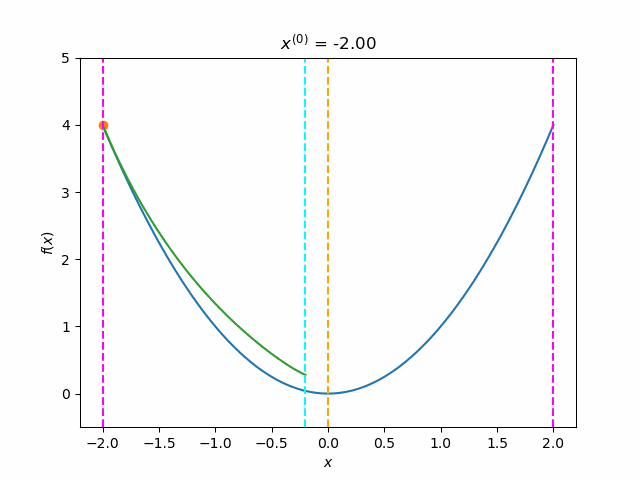
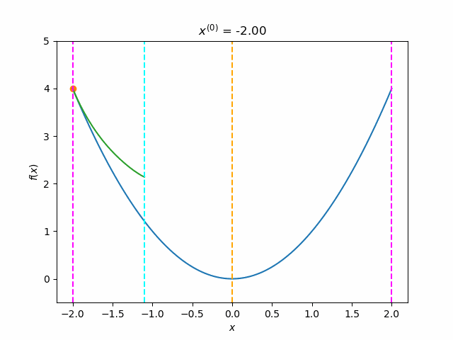
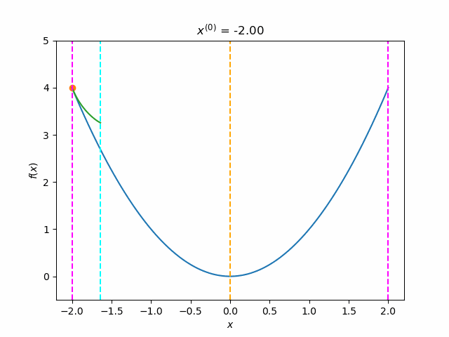
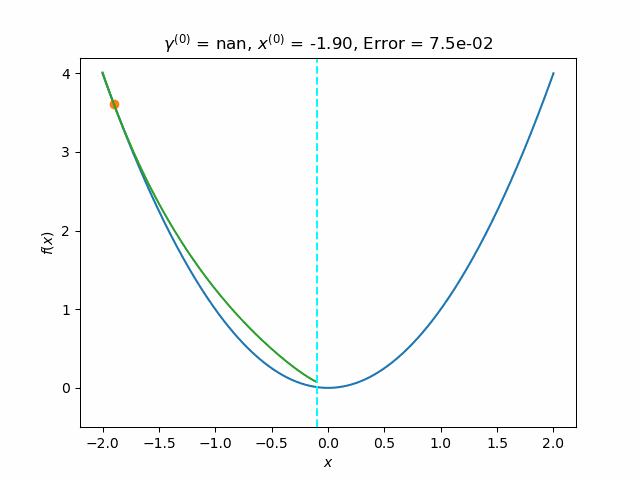
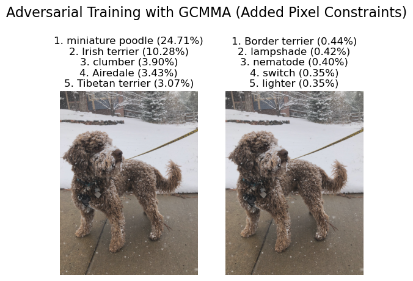

# APPM5630_Project_MMA
Explores the Method of Moving Asymptotes by Svanberg as a sequential convex programming method.

The notebook [demo.ipynb](demo.ipynb) accompanies the [the report](./APPM5630_Project.pdf) and [presentation](./MMA.pptx).  Throughout, an external [code by Arjen Deetman](https://github.com/arjendeetman/GCMMA-MMA-Python/tree/master/Code) is used. This code is based on [Svanberg's own code](http://www.smoptit.se/). Comments are added where we reuse some of Arjen Deetman's code. Any liscensing issues should be directed to the original authors.

PyTorch, Numpy, and matplotlib are used extensively. Cooper (as presented [here](https://github.com/cooper-org/cooper)), is used just for the constrained minimization problem wrapper. This setup would then allow us to apply the Primal-Dual Adam / SGD type optimization that is supported by Cooper, with minimal changes (the box constraints would need to be added as inequality constraints). I did not evaluate using constraints with any of the deep learning optimization methods (Adam), but if I did, I would use Cooper.

## Some gifs to go Along with the Report

### Approximation Functions
The purpose of these gifs is to show how the convexity of the approximate depends on the asymptotes.

Default initialization of moving asymptotes:

Twice as close moving asymptotes:

Five times as close moving asymptotes:

### Moving Asymptotes Example
The purpose of this gif is to show the main ideas of the method of moving asymptotes. This includes the expansion / contraction of the asymptotes, and sequequential convex programming.

## Results of Adversarial Training with GCMMA

